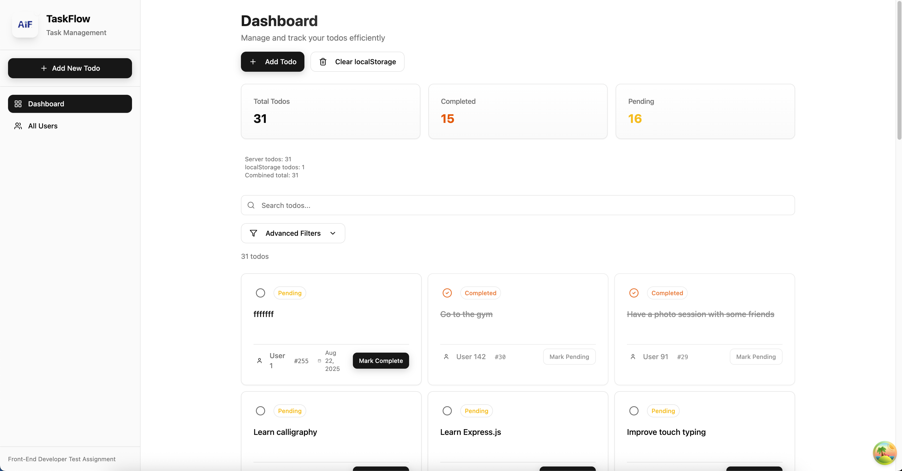

# TaskFlow - Front-End Developer Test Assignment



## 🚀 Features

- **Complete CRUD Operations**: Create, read, update, and delete todos
- **API Integration**: Connected to DummyJSON API
- **Responsive Design**: Works on desktop and mobile
- **Advanced Filtering**: Filter by status, user, and search
- **User Management**: Browse users and view their todos
- **Optimistic Updates**: Immediate UI feedback with rollback
- **Data Caching**: Intelligent caching with TanStack Query

## 🛠️ Tech Stack

- **Frontend**: React 18, TypeScript, Vite
- **Data**: TanStack Query v5, Axios
- **Styling**: TailwindCSS v3, shadcn/ui
- **Forms**: React Hook Form, Zod validation
- **Icons**: Lucide React

## 📱 Pages

- `/` - Dashboard with todos and filters
- `/todo/:id` - Todo detail view
- `/users` - Browse all users
- `/users/:userId/todos` - User-specific todos

## 🚀 Getting Started

### Prerequisites
- Node.js (v16+)

### Installation

1. **Clone and install**
   ```bash
   git clone https://github.com/Thavisoukmnlv9/Front-End-Developer-Test-Assignment.git
   cd Front-End-Developer-Test-Assignment
   npm install
   ```

2. **Start development server**
   ```bash
   npm run dev
   ```

3. **Open browser** at `http://localhost:8080`

### Build
```bash
npm run build
npm run preview
```

## 📁 Project Structure

```
src/
├── components/     # UI components and layouts
├── hooks/         # Custom React hooks
├── lib/           # API client and utilities
├── pages/         # Route components
├── types/         # TypeScript definitions
└── App.tsx        # Main app component
```

## 🔗 API Integration

Uses [DummyJSON API](https://dummyjson.com) for:
- CRUD operations on todos
- User management
- Optimistic updates with error rollback

## 🎯 Key Features

- **Dashboard**: Statistics, search, and filtering
- **Todo Management**: Create, edit, delete with validation
- **Responsive Design**: Mobile-first approach
- **Loading States**: Skeleton loaders and indicators
- **Error Handling**: Graceful error states with retry options


## 🤝 Contributing

1. Fork the repository
2. Create feature branch
3. Commit changes
4. Open Pull Request

## 📄 License

MIT License

## 🙏 Acknowledgments

- [TanStack Query](https://tanstack.com/query)
- [shadcn/ui](https://ui.shadcn.com/)
- [DummyJSON](https://dummyjson.com)
- [TailwindCSS](https://tailwindcss.com)
